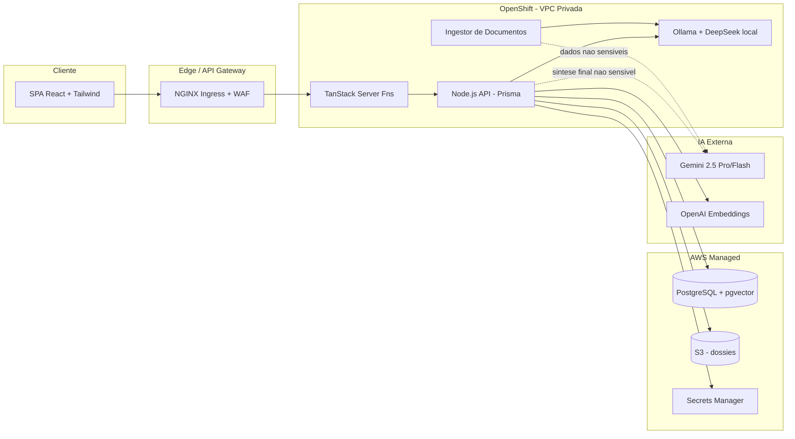
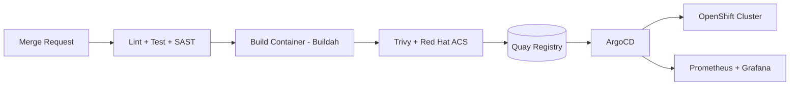

# Arquitetura & Tech Stack — Edu-Gov

> Manual técnico base da plataforma governamental de inteligência pedagógica **Edu-Gov**.

## Índice
1. [Visão Geral](#1-visão-geral)
2. [Topologia (Mermaid)](#2-topologia-mermaid)
3. [Front-end](#3-front-end)
4. [Back-end e APIs](#4-back-end-e-apis)
5. [Camada de IA — Córtex](#5-camada-de-ia--córtex)
6. [Infraestrutura Multi-Cluster (OpenShift + AWS)](#6-infraestrutura-multi-cluster-openshift--aws)
7. [Pipelines CI/CD (GitLab CI + ArgoCD)](#7-pipelines-cicd-gitlab-ci--argocd)
8. [Observabilidade](#8-observabilidade)
9. [Ambientes](#9-ambientes)

---

## 1. Visão Geral

Edu-Gov é um sistema **multi-tenant** para redes públicas de ensino. Combina três camadas:

| Camada | Responsabilidade |
|---|---|
| **Apresentação** | SPA React (TanStack Start) — dashboards, dossiês, console Córtex |
| **Serviços** | APIs Node.js/TypeScript com Prisma; server functions TanStack para BFF |
| **Inteligência** | Córtex de IA — roteador cognitivo + RAG (pgvector) + modelos locais/externos |

Princípios: **LGPD by design**, **zero alucinação** (RAG obrigatório), **soberania de dados** (IA local para dados sensíveis) e **alta densidade informacional** na UI.

---

## 2. Topologia (Mermaid)

---

## 3. Front-end

- **Framework:** TanStack Start (SSR + file-based routing).
- **UI:** Tailwind CSS v4 + shadcn/ui + Radix; tokens semânticos definidos em `src/styles.css`.
- **Estado servidor:** TanStack Query (cache, invalidation, SSR hydration).
- **Estado local:** hooks nativos; Zustand somente quando necessário (não abusar).
- **Formulários:** react-hook-form + Zod.
- **Gráficos:** Recharts (Heat map de turmas, Radar do dossiê).
- **Padrões:**
  - Componentes pequenos e reutilizáveis em `src/components/`.
  - Roteamento apenas via `@tanstack/react-router`.
  - Sem cores hard-coded — usar tokens (`bg-primary`, `text-muted-foreground`).

## 4. Back-end e APIs

- **Runtime:** Node.js 20 LTS, TypeScript strict.
- **Framework:** Fastify (APIs públicas) + TanStack `createServerFn` (BFF interno).
- **ORM:** Prisma com migrações versionadas.
- **Autenticação:** Supabase Auth (JWT HS256/RS256); bearer no header `Authorization`.
- **Contratos:** OpenAPI 3.1 gerado a partir de Zod (`zod-to-openapi`).
- **Filas:** BullMQ + Redis para pipeline de ingestão assíncrono.
- **Server routes públicos:** `src/routes/api/public/*` para webhooks e cron (validação HMAC).

## 5. Camada de IA — Córtex

| Componente | Tecnologia | Papel |
|---|---|---|
| **Roteador Cognitivo** | TypeScript puro | Decide `local` vs `externo` por MIME/sensibilidade |
| **OCR/Multimodal** | Gemini 2.5 Flash | PDFs escaneados, imagens, gráficos |
| **Extração leve** | DeepSeek via Ollama (local) | Sentimento, keywords, dados sensíveis (LGPD) |
| **Síntese final** | Gemini 2.5 Pro | Consolidação dos 3 eixos + plano de ação |
| **Embeddings** | `text-embedding-3-small` (1536d) | Vetorização de chunks para RAG |
| **Vector store** | pgvector + HNSW cosine | `documento_chunks` |

Fluxo RAG: `match_documento_chunks(aluno_id, query_embedding, k=8)` → contexto → prompt clínico → JSON estruturado.

## 6. Infraestrutura Multi-Cluster (OpenShift + AWS)

- **OpenShift** (on-prem/AWS ROSA) hospeda cargas com dados sensíveis (Ollama, ingestor, API principal).
- **AWS**: RDS PostgreSQL Multi-AZ, S3 (bucket `dossies` privado + KMS), Secrets Manager, CloudFront para assets estáticos.
- **Segmentação de rede:** VPC privada; egress controlado por NAT gateway + allowlist para gateways de IA externa.
- **DR:** snapshots RDS diários; replicação cross-region opcional; backup S3 versionado + Object Lock (compliance WORM).

## 7. Pipelines CI/CD (GitLab CI + ArgoCD)

- **GitLab CI:** estágios `lint → test → build → scan → deploy-staging → deploy-prod` (gate manual em prod).
- **ArgoCD:** GitOps declarativo com `Application` por serviço; sync automático em `staging`, manual em `prod`.
- **Assinatura:** cosign nas imagens; verificação por Sigstore policy no admission controller.

## 8. Observabilidade

- **Logs:** OpenTelemetry → Loki.
- **Métricas:** Prometheus + Grafana (dashboards por SLI: latência de ingestão, taxa de rota externa, custo/token por análise).
- **Traces:** Tempo/Jaeger.
- **Alerting:** Alertmanager → PagerDuty; SLO 99,5% API.

## 9. Ambientes

| Ambiente | Cluster | Banco | Modelos IA |
|---|---|---|---|
| `dev` | Namespace shared | RDS single-AZ | Ollama local; externo mockado |
| `staging` | OCP staging | RDS Multi-AZ small | Gemini Flash (limite baixo) |
| `prod` | OCP prod | RDS Multi-AZ + Read Replica | Gemini Pro + Ollama HA |

> **Nota:** todo tráfego para modelos externos passa pelo **Gateway de IA**, que anonimiza payloads e aplica rate-limit por escola.
