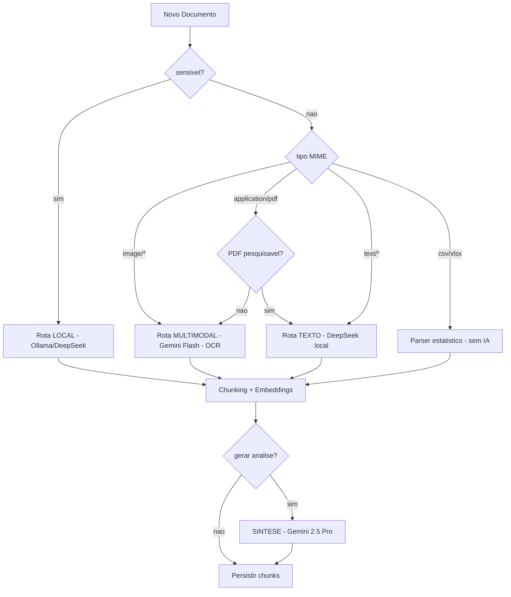

# Lógica de Negócio — Edu-Gov

> Manual de regras negociais: pontos de função, roteamento de IA e gatilhos de intervenção.

## Índice
1. [Pontos de Função](#1-pontos-de-função)
2. [Árvore de Decisão do Córtex de IA](#2-árvore-de-decisão-do-córtex-de-ia)
3. [Gatilhos de Intervenção](#3-gatilhos-de-intervenção)
4. [Priorização (SLA Pedagógico)](#4-priorização-sla-pedagógico)
5. [Regras de Consolidação Multi-Eixo](#5-regras-de-consolidação-multi-eixo)

---

## 1. Pontos de Função

| # | Função | Atores | Descrição |
|---|---|---|---|
| PF-01 | **Onboarding de rede** | Admin | Cadastro em massa de escolas via importação SEDUC/MEC |
| PF-02 | **Importação de dados governamentais** | Admin, Direção | Ingestão de planilhas de matrícula, notas e frequência |
| PF-03 | **Geração de Dossiê do Aluno** | Direção, Coordenação, Professor | Consolida notas + docs + relatos + IA em 3 eixos |
| PF-04 | **Alerta de Evasão** | Sistema | Detecta risco por queda de frequência e desempenho |
| PF-05 | **Cruzamento notas × relatos comportamentais** | Coordenação | RAG cruza avaliações com registros qualitativos |
| PF-06 | **Emissão de Plano de Ação** | Direção | Recomendações por público (direção/professor/pais) |
| PF-07 | **Heat map de turmas** | Direção | Visão comparativa (desempenho × frequência) |
| PF-08 | **Radar de competências** | Professor, Pais | Perfil multidimensional do aluno |
| PF-09 | **Acompanhamento de intervenção** | Coordenação | Ciclo Sugerida → Aceita → Em andamento → Concluída |
| PF-10 | **Auditoria pedagógica** | Admin | Rastreabilidade completa de análises e decisões |

## 2. Árvore de Decisão do Córtex de IA



**Regras determinísticas (código):**

```ts
export function rotearIngestao({ mime, sensivel }: Entrada) {
  if (sensivel)               return rota("local",      "deepseek-r1:14b",     "LGPD Restrito");
  if (mime.startsWith("image/")) return rota("multimodal", "gemini-2.5-flash", "OCR Visual");
  if (mime === "application/pdf" && !pesquisavel) return rota("multimodal", "gemini-2.5-flash", "PDF escaneado");
  if (mime.startsWith("text/") || mime === "application/pdf") return rota("local", "deepseek-r1:14b", "Extração leve");
  if (isTabular(mime))        return rota("parser",     "papaparse/xlsx",       "Sem IA");
  return rota("local", "deepseek-r1:14b", "fallback");
}
```

**Critério de escalação para modelo externo pago:**
- Documento **não sensível** E
- Necessidade de multimodalidade (imagem/PDF escaneado) OU
- Síntese final do dossiê (Gemini 2.5 Pro), que exige raciocínio consolidando múltiplas fontes.

## 3. Gatilhos de Intervenção

Regras "Se ... Então ..." avaliadas em job diário e sob demanda.

| ID | Se... | Então... | Severidade | Público |
|---|---|---|:-:|---|
| G-01 | queda média ≥ 2,0 pontos em disciplina entre bimestres | criar intervenção EDUCACIONAL "reforço em {disciplina}" | 3 | Professor |
| G-02 | frequência mensal < 75% | intervenção SOCIOEMOCIONAL "risco de evasão" | 4 | Direção + Pais |
| G-03 | ≥ 3 relatos comportamentais negativos em 30 dias | intervenção SOCIOEMOCIONAL "avaliar apoio psicopedagógico" | 4 | Coordenação |
| G-04 | nota < 4,0 E docs indicam dificuldade de interpretação | intervenção COGNITIVA "leitura assistida" | 3 | Professor |
| G-05 | 2 gatilhos ativos simultâneos | escalar para Direção + acionar plano integrado | 5 | Direção |
| G-06 | melhora média ≥ 1,5 pt após intervenção aceita | registrar sucesso e sugerir replicar padrão na turma | 1 | Coordenação |

**Anti-ruído:** cada gatilho tem cooldown de 14 dias por aluno para evitar alarmes repetidos.

## 4. Priorização (SLA Pedagógico)

| Severidade | Cor | Ação esperada | Prazo |
|:-:|---|---|---|
| 5 | Vermelho | Reunião multidisciplinar | 48h |
| 4 | Laranja | Plano de ação formal | 5 dias úteis |
| 3 | Amarelo | Ação em sala + follow-up | 10 dias úteis |
| 2 | Azul | Acompanhamento mensal | mensal |
| 1 | Verde | Registro positivo | — |

## 5. Regras de Consolidação Multi-Eixo

O relatório final **obriga** classificação nos três eixos:

- **Educacional** — desempenho por disciplina, indicadores objetivos (notas, faltas, produções).
- **Cognitivo** — habilidades de leitura, raciocínio lógico, atenção, memória.
- **Socioemocional** — tom emocional, vínculos, sinais de risco, engajamento.

**Regra Zero Alucinação:** cada afirmação no relatório deve citar pelo menos uma `fonte` (documento_chunk) recuperada via RAG. Afirmações sem evidência são descartadas ou marcadas como "hipótese".

**Plano de ação obrigatório por público:**
- Direção: decisões estratégicas.
- Professor: ações pedagógicas em sala.
- Pais/responsáveis: orientações práticas em linguagem simples.
