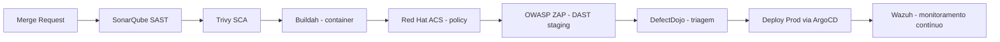

# Segurança & DevSecOps — Edu-Gov

> Manual de segurança da plataforma governamental Edu-Gov.

## Índice
1. [Modelo de Ameaças (STRIDE)](#1-modelo-de-ameaças-stride)
2. [Autenticação e Autorização](#2-autenticação-e-autorização)
3. [RBAC — Matriz de Papéis](#3-rbac--matriz-de-papéis)
4. [Pipeline DevSecOps](#4-pipeline-devsecops)
5. [Runtime Security](#5-runtime-security)
6. [Proteção de Dados & LGPD](#6-proteção-de-dados--lgpd)
7. [Resposta a Incidentes](#7-resposta-a-incidentes)

---

## 1. Modelo de Ameaças (STRIDE)

| Ameaça | Vetor | Controle |
|---|---|---|
| **S**poofing | Roubo de credencial | MFA obrigatório para `admin`/`direcao`, tokens curtos |
| **T**ampering | Alteração de nota | Auditoria imutável + assinatura de payload |
| **R**epudiation | Negar intervenção | Log WORM com `criado_por`, `ip`, `user_agent` |
| **I**nformation disclosure | Vazamento LGPD | RLS + criptografia at-rest KMS + anonimização IA |
| **D**enial of service | Flood de upload | Rate-limit por escola + BFF com circuit breaker |
| **E**oP | Escalada via SQLi | Prisma parametrizado + WAF + varredura SAST |

## 2. Autenticação e Autorização

- **Autenticação:** OIDC via Supabase Auth (e-mail/senha, Google, SAML SSO governamental).
- **Tokens:** JWT com `exp=1h`, refresh rotativo (`refresh_token` httpOnly em cookie `SameSite=Strict`).
- **MFA:** TOTP obrigatório para papéis `admin` e `direcao`.
- **Autorização:** RBAC persistido na tabela `public.user_roles` (jamais em `profiles`) + função `has_role(uid, role)` `SECURITY DEFINER`.
- **RLS:** ativa em todas as tabelas `public.*`. Políticas escopadas por `auth.uid()` e/ou `has_role()`.

## 3. RBAC — Matriz de Papéis

| Recurso / Ação | admin | direcao | coordenacao | professor | pais |
|---|:-:|:-:|:-:|:-:|:-:|
| Criar/editar escolas | ✅ | ❌ | ❌ | ❌ | ❌ |
| Importar dados gov | ✅ | ✅ | ❌ | ❌ | ❌ |
| Ver dossiê aluno | ✅ | ✅ (sua escola) | ✅ (sua turma) | ✅ (sua turma) | ✅ (filho) |
| Upload documentos | ✅ | ✅ | ✅ | ✅ | ❌ |
| Gerar análise Córtex | ✅ | ✅ | ✅ | ✅ | ❌ |
| Aceitar/rejeitar intervenção | ✅ | ✅ | ✅ | ❌ | ❌ |
| Purge LGPD | ✅ | ❌ | ❌ | ❌ | ❌ |

## 4. Pipeline DevSecOps



**Gates obrigatórios (falha bloqueia merge):**
- SonarQube: 0 vulnerabilidade CRITICAL, 0 HIGH sem waiver.
- Trivy: 0 CVE HIGH/CRITICAL em imagem base.
- ACS: nenhuma policy violation em `deploy` stage.
- Cobertura de testes ≥ 75% em serviços críticos (auth, córtex, ingestão).

## 5. Runtime Security

- **Wazuh** como HIDS/XDR em todos os nós OpenShift (regras CIS + regras custom para tentativa de leitura de segredos).
- **Falco** para syscalls anômalas em containers do Córtex (ex.: shell dentro do container Ollama → alerta P1).
- **Network Policies:** deny-all default; egress explícito por serviço; namespace `cortex-local` **sem egress à internet**.
- **Segredos:** AWS Secrets Manager com rotação 90d; injetados via CSI Driver (não em `env`).

## 6. Proteção de Dados & LGPD

> ⚠️ **Dados de menores exigem tratamento reforçado.** Nunca logar payloads brutos, nunca enviar dados sensíveis a modelos externos.

**Classificação:**
| Nível | Exemplos | Trânsito permitido |
|---|---|---|
| Público | INEP, nome da escola | qualquer |
| Interno | Nome do aluno, nota | dentro da VPC + IA externa após anonimização |
| **Sensível** | Laudos médicos, relatos disciplinares, laudos socioemocionais | **exclusivamente IA local (Ollama/DeepSeek)** |

**Regra de roteamento (código):**
```ts
if (documento.sensivel) return { rota: "local", modelo: "deepseek-r1:14b" };
```

**Anonimização (obrigatória antes de IA externa):**
- Substitui `nome`, `matrícula`, `CPF`, `endereço`, `telefone` por tokens (`[[ALUNO_1]]`).
- Remove metadados EXIF de imagens antes do OCR externo.
- Cabeçalhos e rodapés de PDFs escaneados são recortados.

**Direitos do titular:** endpoint `DELETE /api/v1/alunos/:id` executa purge em ≤ 30 dias e emite recibo assinado.

## 7. Resposta a Incidentes

Playbook resumido (detalhado em `/docs/runbooks/`):

1. **Detecção:** alerta Wazuh/Falco → PagerDuty (P1: 15 min SLA).
2. **Contenção:** revogar tokens do usuário afetado (`supabase auth admin sign-out`), isolar pod via NetworkPolicy `deny-all`.
3. **Erradicação:** rotacionar segredos (Secrets Manager), reconstruir imagem limpa.
4. **Recuperação:** restore de snapshot RDS point-in-time se houver corrupção.
5. **Lições aprendidas:** post-mortem em 5 dias úteis, ticket no DefectDojo.

> **Notificação ANPD:** incidentes com dados pessoais devem ser reportados em até **2 dias úteis** conforme LGPD art. 48.
